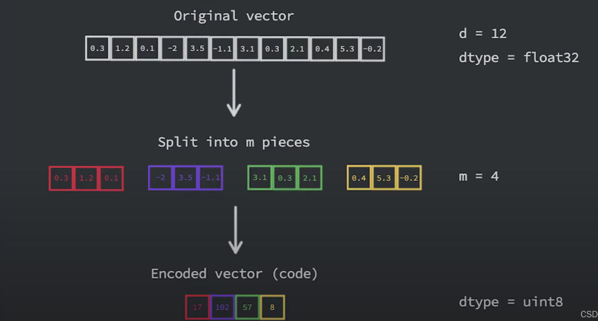
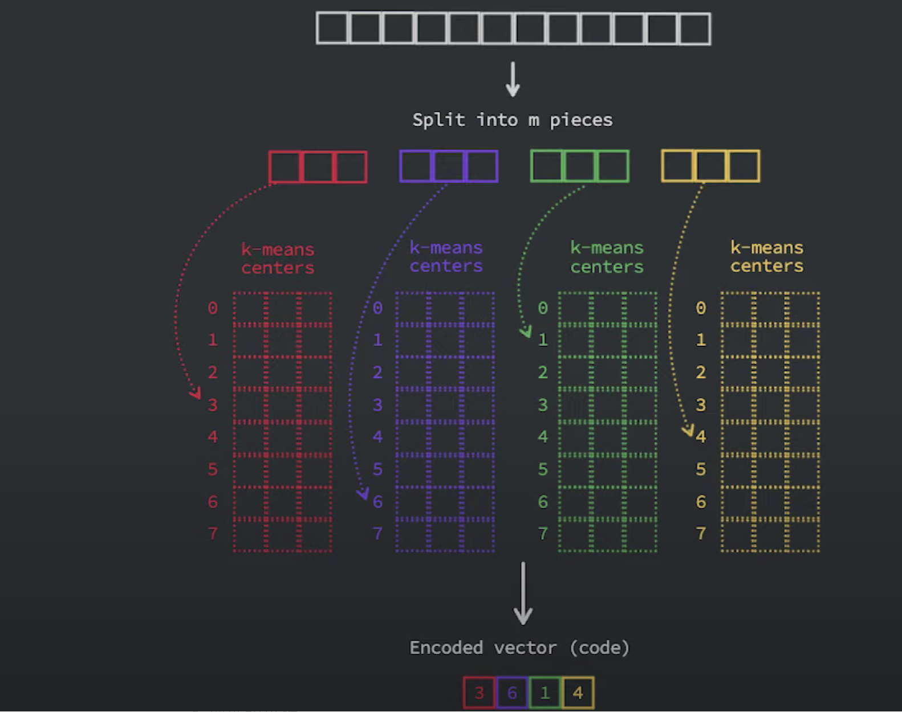
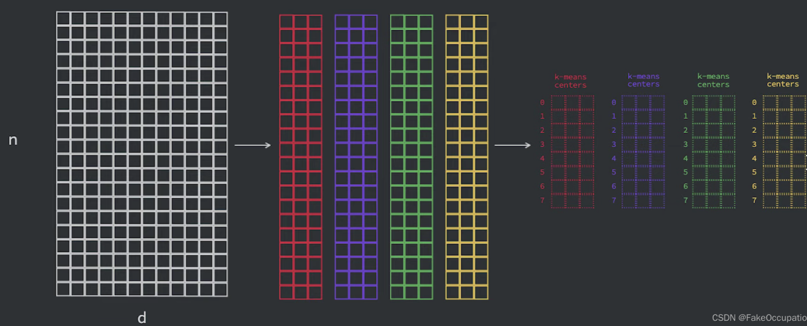

# faiss的常用三种数据索引方式

[Faiss](https://so.csdn.net/so/search?q=Faiss&spm=1001.2101.3001.7020) 中有常用的三种索引方式：`IndexFlatL2`、`IndexIVFFlat` 和 `IndexIVFPQ`。


# 1 **`IndexFlatL2` - 暴力检索L2**

- 使用欧氏距离（L2）进行精确检索。

- 适用于较小规模的数据集，采用暴力检索的方式，即计算查询向量与所有数据库向量之间的距离，然后返回相似度最高的前 k 个向量。

  ```python
  import faiss
  
  d = 200  # 向量维度
  index = faiss.IndexFlatL2(d)  # 构建索引
  data = ...  # 添加数据
  index.add(data)  # 添加数据到索引
  k = 500  # 返回结果个数
  query = ...  # 查询向量
  dis, ind = index.search(query, k)  # 查询相似内容
  
  ```

  

# 2 **`IndexIVFFlat` - 倒排索引，加速：**

- 使用倒排索引结构，将数据集划分为多个聚类空间，以加速搜索。
- 在查询阶段，首先定位到可能包含相似向量的聚类中心，然后在该聚类中心附近进行精确搜索。

```python
import faiss

d = 200  # 向量维度
nlist = 10000  # 聚类空间
k = 500  # 返回结果个数
quantizer = faiss.IndexFlatL2(d)  # 量化器
index = faiss.IndexIVFFlat(quantizer, d, nlist)  # 构建索引
index.nprobe = 20  # 查找聚类中心的个数
index.train(data)  # 训练
index.add(data)  # 添加数据到索引
dis, ind = index.search(query, k)  # 查询相似内容
```


# 3 **`IndexIVFPQ` - 省空间超快：**

- 使用 Product Quantization（PQ）技术进行有损压缩，以节省内存。
- 在查询阶段，返回近似结果。

```python
import faiss

d = 200  # 向量维度
m = 8  # 空间拆分
nlist = 10000  # 聚类空间
k = 500  # 返回结果个数
quantizer = faiss.IndexFlatL2(d)
index = faiss.IndexIVFPQ(quantizer, d, nlist, m, 8)  # 每个向量用8 bits 编码
index.nprobe = 20  # 查找聚类中心的个数
index.train(data)  # 训练
index.add(data)  # 添加数据到索引
dis, ind = index.search(query, k)  # 查询相似内容

```

```python
// https://github1s.com/facebookresearch/faiss/blob/HEAD/tutorial/python/3-IVFPQ.py#L6-L32
import numpy as np

d = 64                           # dimension
nb = 100000                      # database size
nq = 10000                       # nb of queries
np.random.seed(1234)             # make reproducible
xb = np.random.random((nb, d)).astype('float32')
xb[:, 0] += np.arange(nb) / 1000.
xq = np.random.random((nq, d)).astype('float32')
xq[:, 0] += np.arange(nq) / 1000.

import faiss

nlist = 100
m = 8
k = 4
quantizer = faiss.IndexFlatL2(d)  # this remains the same
index = faiss.IndexIVFPQ(quantizer, d, nlist, m, 8)
                                  # 8 specifies that each sub-vector is encoded as 8 bits
index.train(xb)
index.add(xb)
D, I = index.search(xb[:5], k) # sanity check
print(I)
print(D)
index.nprobe = 10              # make comparable with experiment above
D, I = index.search(xq, k)     # search
print(I[-5:])
```

这些索引方法在不同场景下有不同的优势，你可以根据数据集大小、内存限制和搜索速度的需求来选择适当的索引类型。

Product quantization in Faiss and from scratch
乘积量化背后的主要思想是，将采用高维嵌入（其中每个元素都是浮点数）转换为更小的向量，其元素是无符号整数，具体位数通常是八位或一个字节。        
为了实现这一点，我们首先将向量分成 m 段，然后将每个段映射到某个固定整数。对于 m 个分段中的每个分段都有 m 个单独的估计器，如果我们假设这些估计器已经经过训练，我们可以简单地使用它们将给定分段分配给集群 id，并且该集群 id 是我们将用来表示的数字



查询过程：



训练的过程：



# 4 索引加载保存

```python
import faiss
import numpy as np

# 创建一些随机数据
np.random.seed(42)
data = np.random.rand(10, 5).astype('float32')

# 创建一个平面索引
index = faiss.IndexFlatL2(5)
index.add(data)

# 保存索引到文件
faiss.write_index(index, "my_index.index")

```

```python
import faiss
import numpy as np
# 加载索引
loaded_index = faiss.read_index("my_index.index")

# 进行相似性搜索
query_vector = np.random.rand(1, 5).astype('float32')
k = 3
D, I = loaded_index.search(query_vector, k)

print("相似度最高的{}个向量的索引: {}".format(k, I))
print("对应的相似度分数: {}".format(D))

```

