# 相似检索算法

最直接的做法是根据向量在给定数据集中采用`KNN`来找到K个最近的向量。

但在实际应用中，待检索的数据往往是千万甚至亿级，`KNN`的计算量过大。

因此，通常采用**ANN（Approximate Nearest Neighbor，相似近邻）**来快速相似检索。

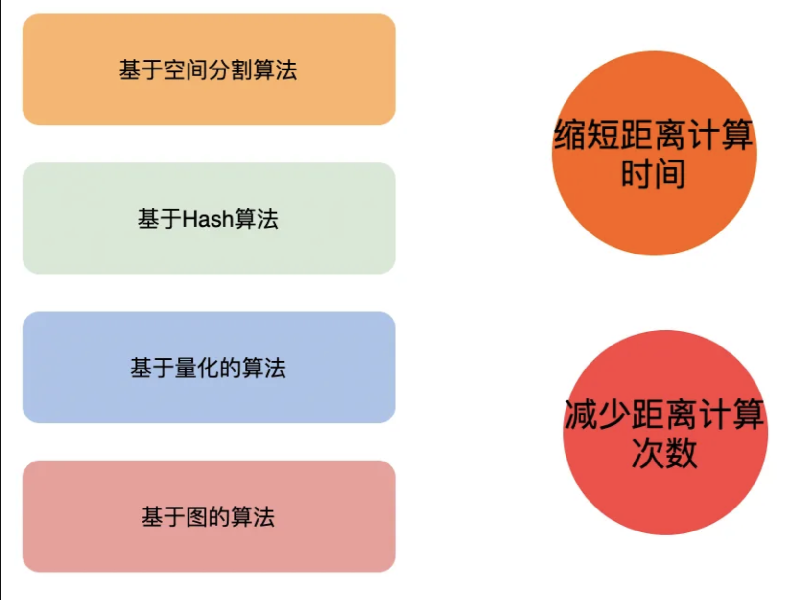

# 1 **相似检索方法**

## 1.1 暴力计算

暴力计算是最直接的方法，召回率为100%，但计算复杂度较高，通常是用它来构造`ground truth`，用于评估其他相似检索方法的效果（召回率）。

## 1.2 基于树的方法

基于树的方法有很多，除了之前在《老生常谈KNN》中介绍的KD-Tree以外，还有BallTree、VPTree，大抵都是采用二叉树的思想，区别在于构造树的时候采用什么策略来划分左、右子树，从而实现对空间的划分。

如下图所示的KD-Tree对应的二叉树。

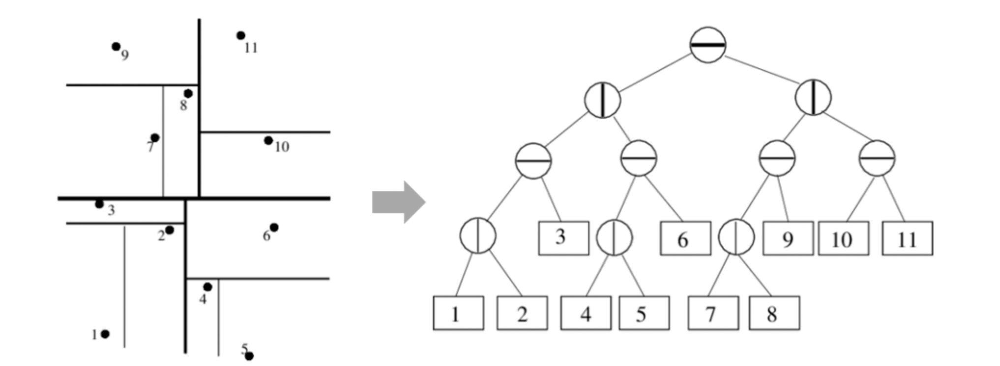

## 1.3 哈希方法

不同与传统哈希（尽量少产生碰撞），在相似检索中，采用的哈希是局部敏感哈希（Locality Sensitive Hashing，LSH），通过局部敏感来找到近邻数据。

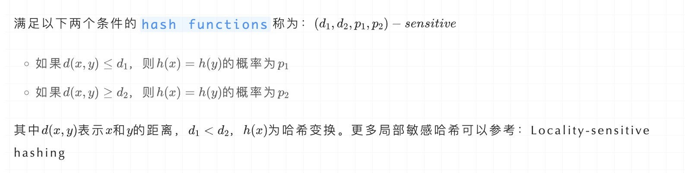

如下图所示，在空间中相近的点被LSH后，有更大概率得到相同的哈希值。

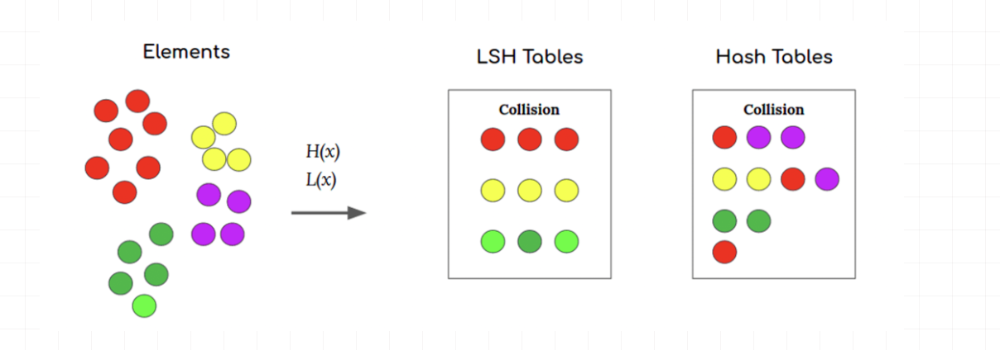

## 1.4 基于倒排索引

传统文档的倒排索引构建是根据文档包含某关键词，然后将它放入该词的倒排索引中。

在相似检索中，向量的倒排索引是通过聚类方法把整个向量空间划分为k个子区域，每个区域用中心点c表示。

在索引构造阶段，只需要与中心点进行对比，将其归属到距离最近的中心点对应的倒排中。如下图所示：

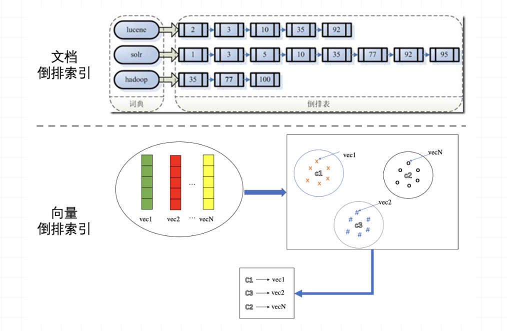

## 1.5 向量量化

向量量化是指把具有很大的值空间量化到一个较小的值范围（例如把连续变量离散化）。常用的量化有PQ（Product Quantization）和二值两种：

**PQ**的原理是将向量空间按维度划分成若干个子空间，然后在每个子空间中采用聚类方法得到N个中心点，最后在各子空间中用向量倒排来表示每个样本，如下图所示：

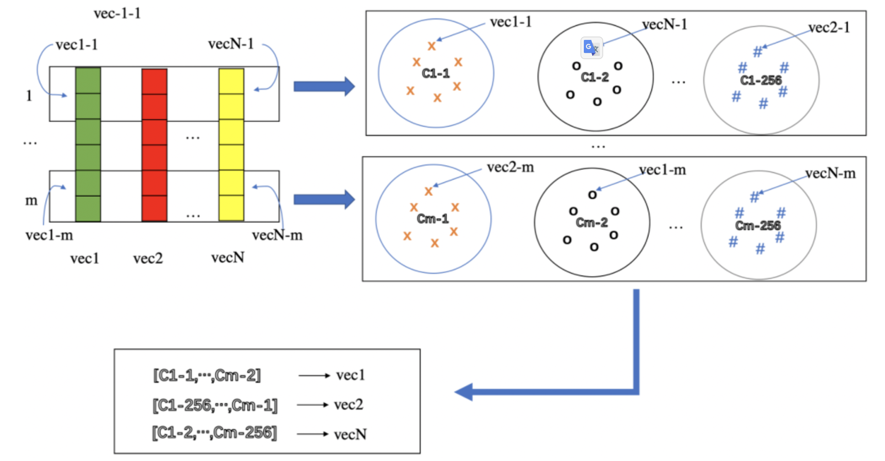

**二值向量**是借助CPU提供的专门指令，来快速计算Hamming距离。在海量向量检索中通常会直接生成二值向量（如Iterative Quantization、DeepHash）。

## 1.6 基于图的方法

上面的相似检索都是基于空间划分的方法，每个向量只会属于某个子区域。它们最大的的问题是为了提高召回率，需要搜索较大空间，导致计算量增加。基于图的方法就可以比较好的解决这一问题。

图的最朴素的想法是**「邻居的邻居也可能是邻居」**，这样把近邻查找转化为图的遍历。由于图的连通性，可以针对性的搜索部分空间，降低搜索范围。

基于图的方法主要有KGraph、NSG、HNSW、NGT等，它们的主要区别在构建过程，不同图方法采用不同的手段来提升图的质量。

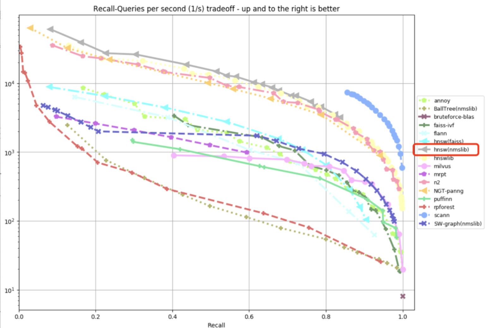

从benchmark中可以看到，HNSW的检索效果力压群雄。本文下面内容将着重介绍HNSW算法。

# 2 图检索算法

## 2.1  **NSW（Navigable Small World）**

### 2.1.1 Small world

- Regular graph指的是每个顶点都有相同数目的邻居的图（每个节点具有相同的度）。在regular graph中，当集聚系数（Clustering coefficient）接近饱和时，集聚系数较高，路径较短，顶点的度较高。

- Random graph指的是每个顶点的邻居数是随机的（即顶点之间的连接是随机建立的）。在random graph中，顶点的集聚系数较低，顶点的度较低。

  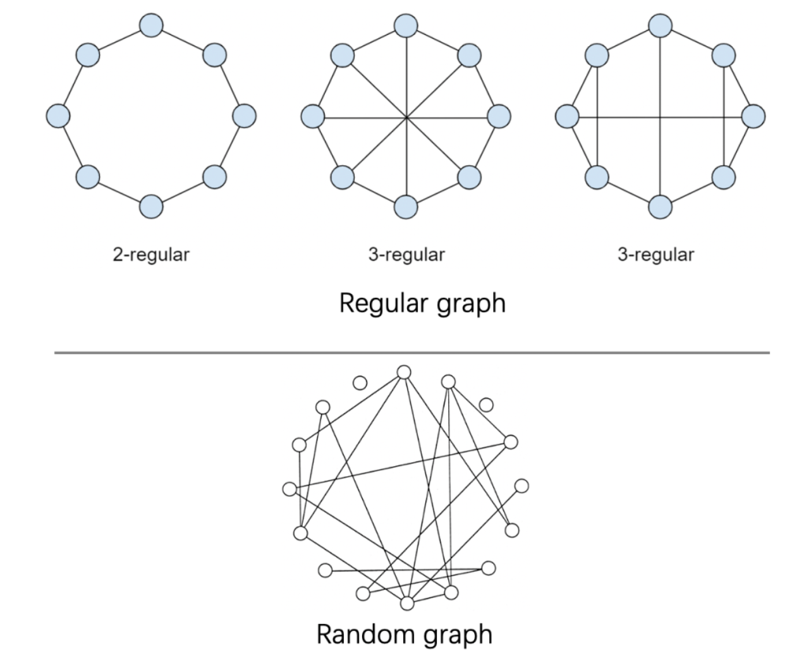

  Small world graph是介于Regular graph 和 Random graph之间，regular graph随着随机性的增加变成small world graph，三者之间关系如下：

  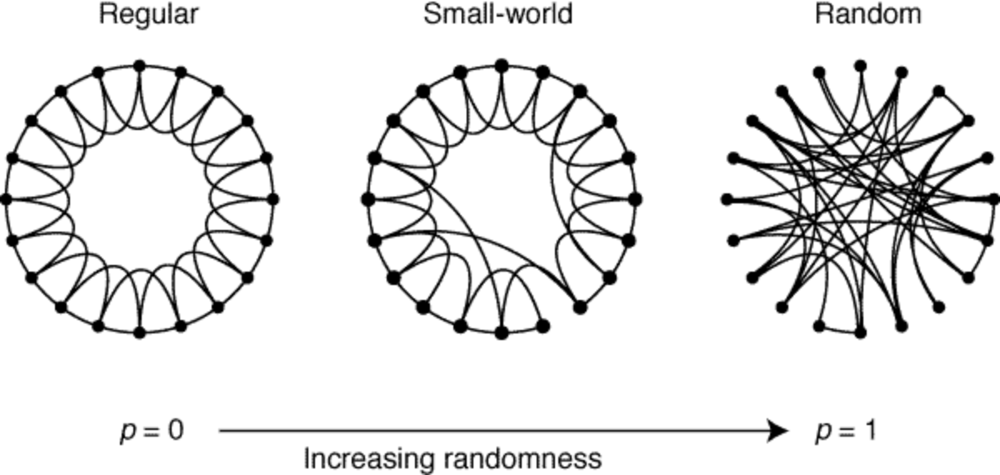

  在Small world graph中，局部同类顶点的连接呈现出regular，全局不同类顶点的连接呈现出random。因此，顶点之间的关系可以分为两种：

  - 同质性：相似的顶点会聚集在一起，相互连接具有邻接边
  - 弱连接：在每个顶点上会有一些随机的边随机连接到网络中的顶点上

  现实世界的社交网络就是一个典型的Small world graph。这里就不得不提一个著名的理论——六度分隔理论：

  > ❝
  >
  > 六度分隔理论（Six Degrees of Separation）：认为世界上任何互不相识的两人，只需要很少的中间人（6个以内）就能够建立起联系。
  >
  > 哈佛大学心理学教授斯坦利·米尔格拉姆于1967年根据这个概念做过一次连锁信实验，尝试证明平均只需要6步就可以联系任何两个互不相识的人。
  >
  > ❞

  该理论指出：

  - 现实世界中的短路径是普遍存在的（对应**「同质性」**）
  - 人们可以有效地找到并利用那些短路径（对应**「弱连接」**）

  理解了Small world graph之后，Navigable small world的原理就很简单了：通过构建一个small world graph，从图中随机选择一个起始顶点，逐个遍历其邻接节点，选择与目标最近的顶点继续遍历，直到找到最近的顶点。

### 2.1.2 图构造

在图论中德劳内三角剖分（Delaunay Triangulation）算法，可以构造具有最小边的局部互为同质节点small world graph：

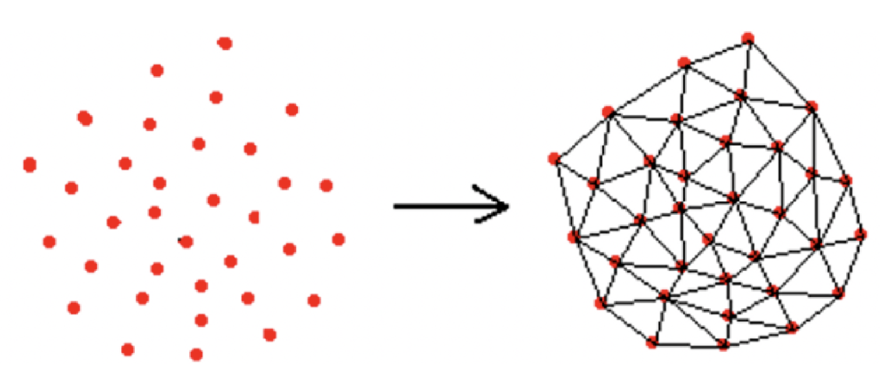

但采用德劳内三角剖分会有如下问题：

- 时间复杂度太高，太耗时
- 得到的small world graph的查找效率并不一定最高（缺少“高速公路”机制）

既然德劳内三角剖分不行，那怎么样在低计算复杂度下构造具有“高速公路”机制的small world graph呢？答案是：`随机`

> ❝
>
> **「随机」**向图中逐个插入顶点：插入新顶点时，通过计算邻居顶点和待插入顶点的距离来决定下一个要进入的顶点。找到与新顶点最近的（超参数）个顶点后，将新顶点它们连接起来形成边
>
> ❞

如下图所示，采用随机方法来构造 m=3 的small world graph：

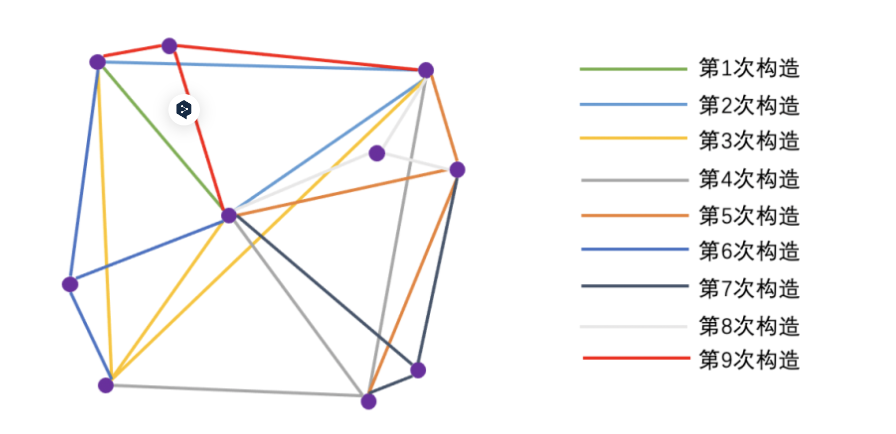

从图中可以看出，刚开始构造的边很大概率会是“高速公路”（越早插入就越容易形成与之相关的“高速公路”连接）。由此可见，采用随机的方式不仅构造图的时间复杂度低，而且还具有“高速公路”特性，加速查找。

### 2.1.3 图检索

在构造好具有“高速公路”连接的small world graph之后，在NSW的检索过程就非常简单了，如下图所示：

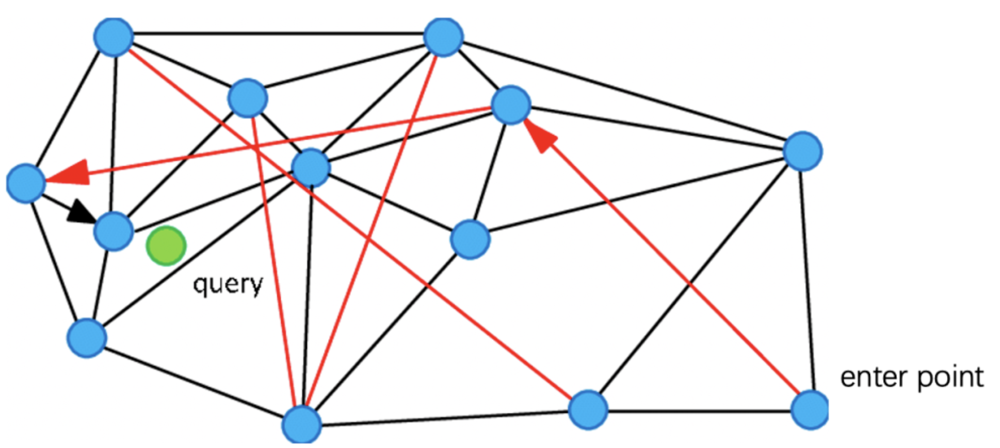

从`enter point`顶点开始查找，查找绿色点的临近顶点，就可以用过红色连线“高速公路机制”快速查找到结果。

## 2.2 **HNSW（Hierarchical Navigable Small World）**

在NSW中，构建图的阶段通过节点的随机插入来引入随机性，构建出一个small world graph，从而实现快速检索。但NSW构造的图并不稳定，节点之间的差异较大：

- 先插入的顶点，其连接的邻居节点，基本都比较远（弱连接属性强）
- 后插入的顶点，其连接的邻居节点，基本都比较近（弱连接属性弱）
- 对于具有聚类效应的点，由于后续插入的点可能都和其建立连接，对应节点的度可能会比较高

如何构造具有更稳定的small world graph呢？HNSW算法就在NSW基础之上引入了分层图的思想，通过对图进行分层，实现由粗到细的检索。

### 2.2.1图构造

HNSW在构造图时如下图所示：

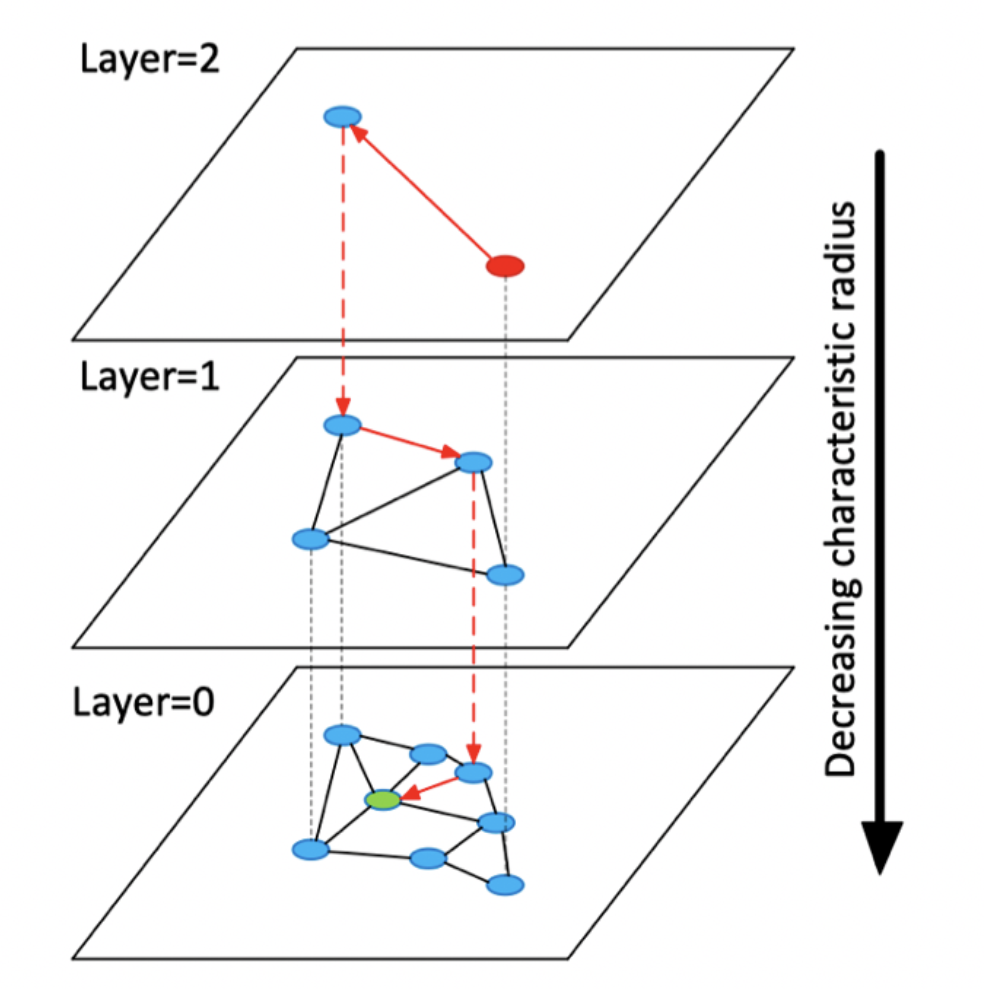

核心如下：

- `layer=0`层包含了数据集中的所有点
- `layer=l`层是以50%的概率随机从`layer=l-1`层中选择的点构成的。因此，最大层数为
- 插入构图时，先计算新顶点可以深入到第几层（），在每层的NSW图中查找m个近邻，然后连接它们

### 2.2.2 图检索

对HNSW进行查询时，从最高层开始检索，逐层往下，从而实现快速搜多

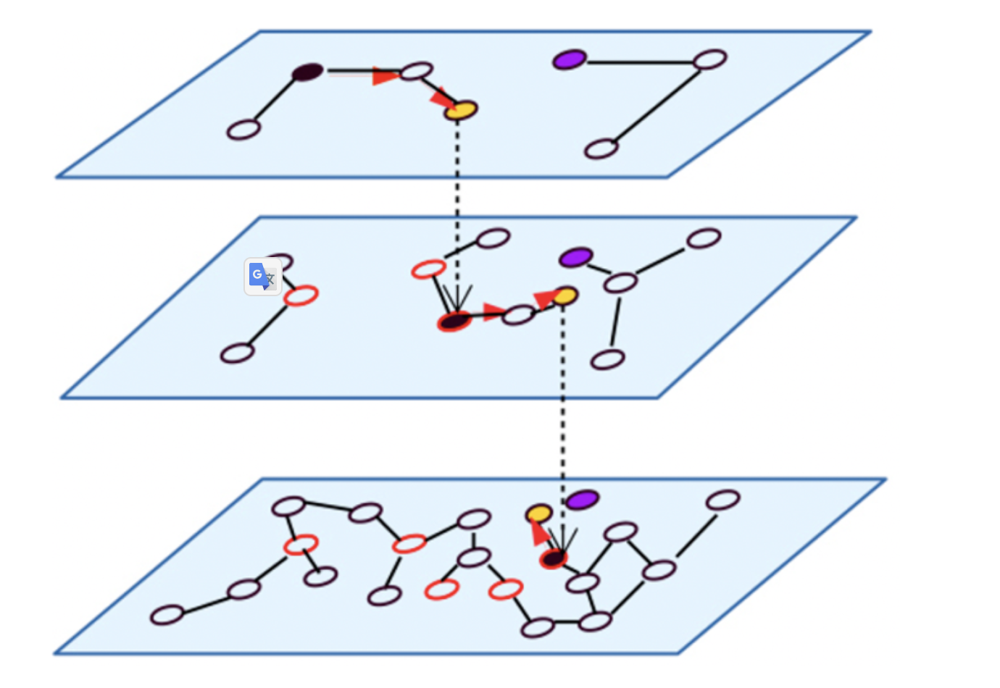

### 2.2.3 检索优化

在`ANN-benchmark`中发现，HNSW算法在余弦距离上效果很好，但在內积距离上表现不佳，主要原因是內积距离不满足三角不等式，距离比较没有传递性，如：

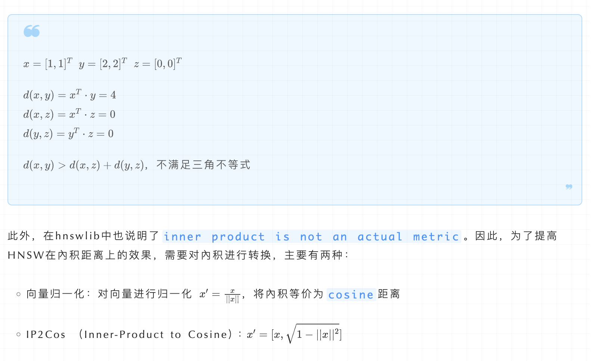

# refernece

https://blog.csdn.net/qq_24654501/article/details/137145644

